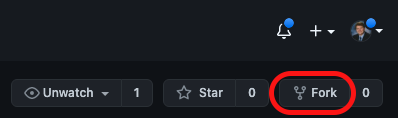
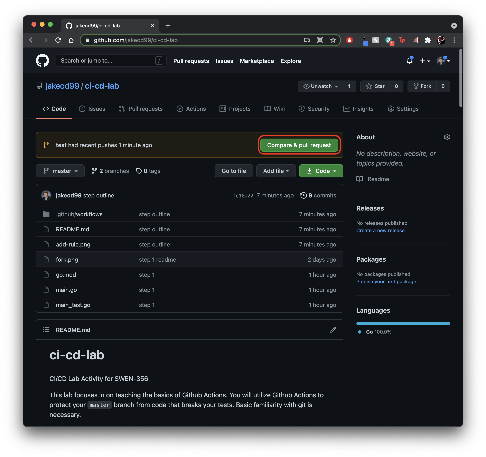
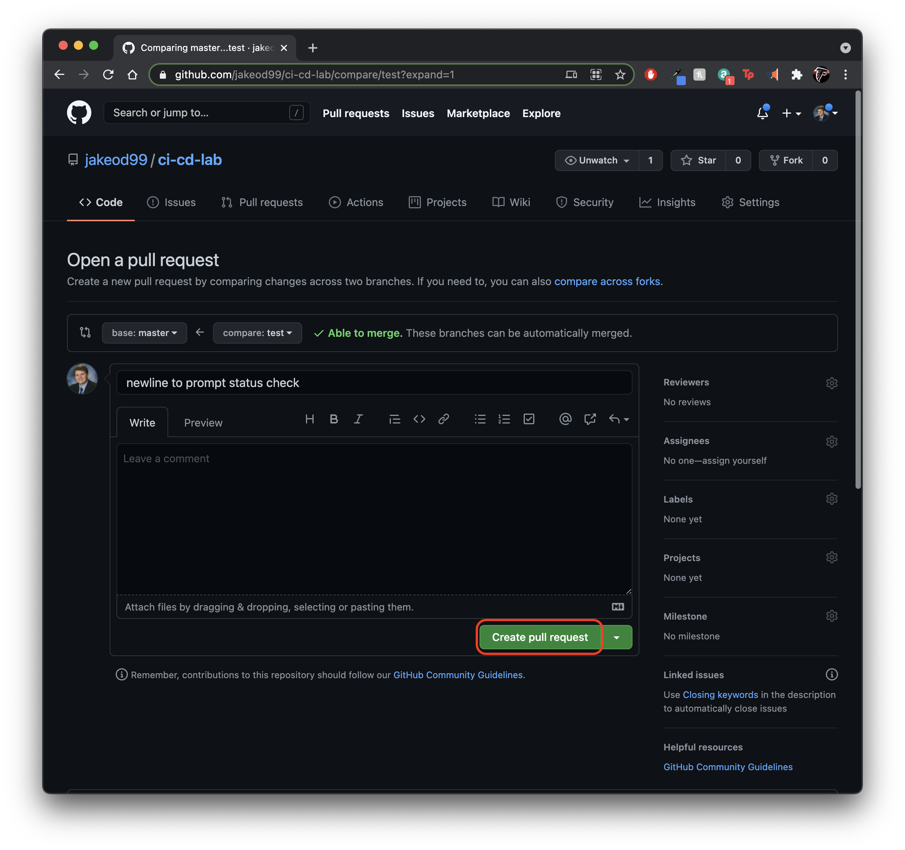
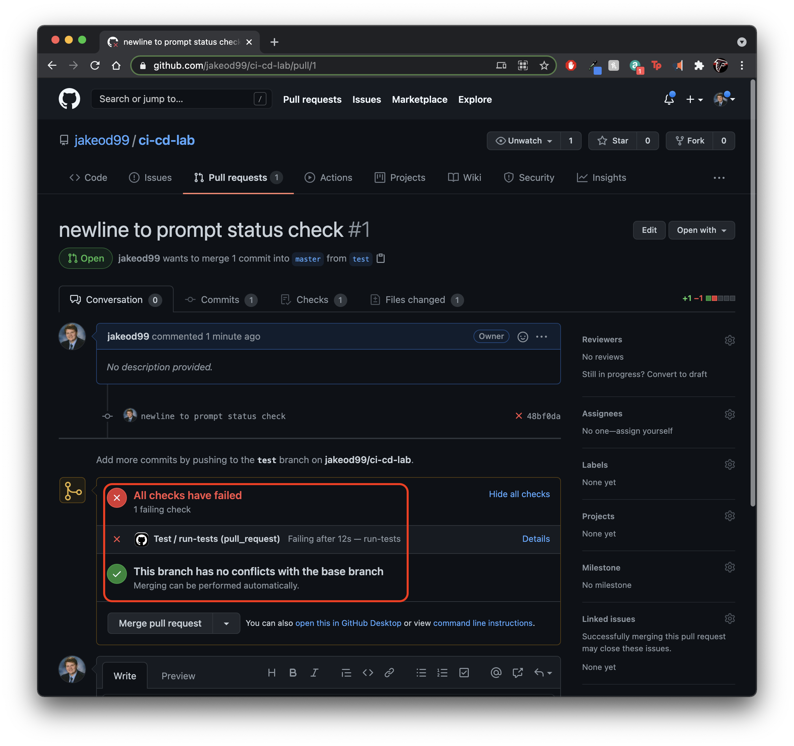
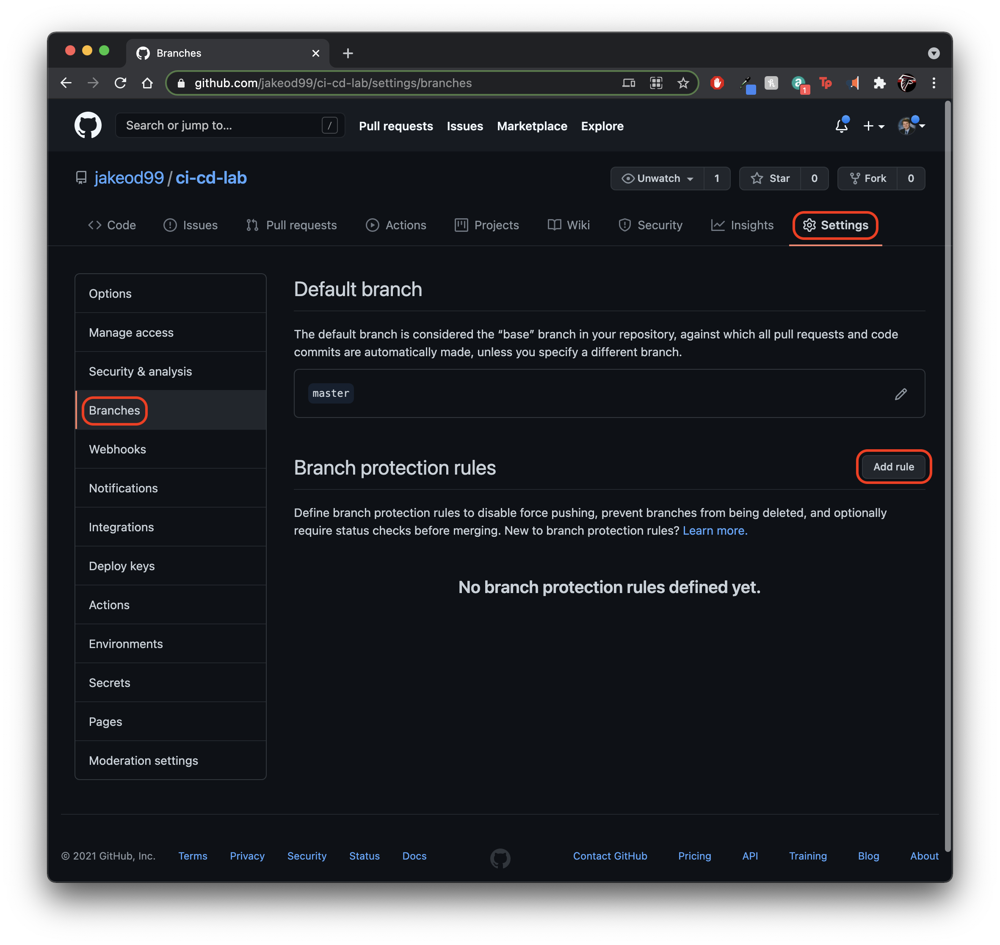
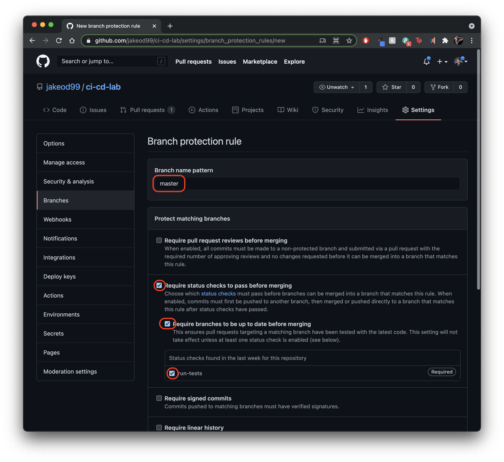
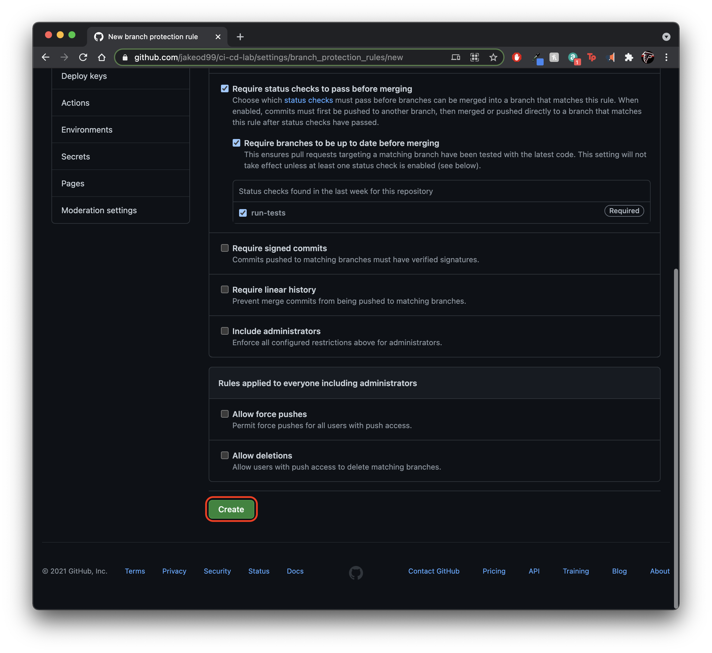
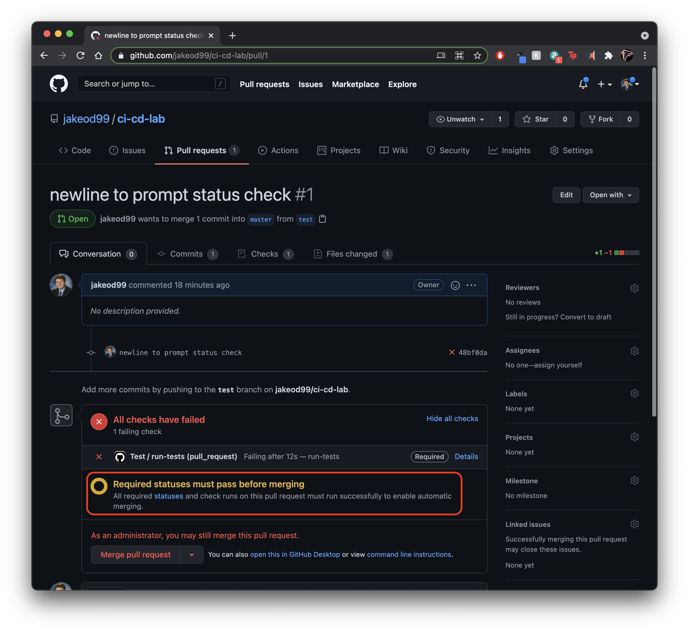
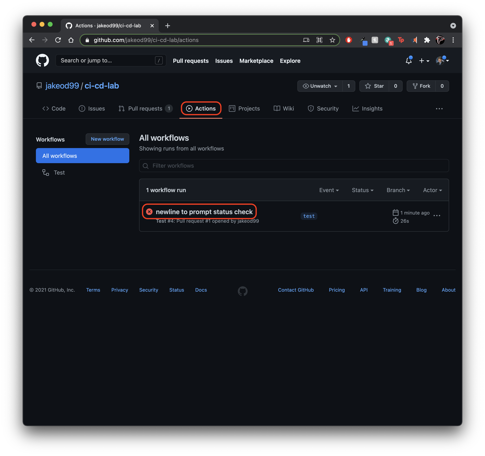
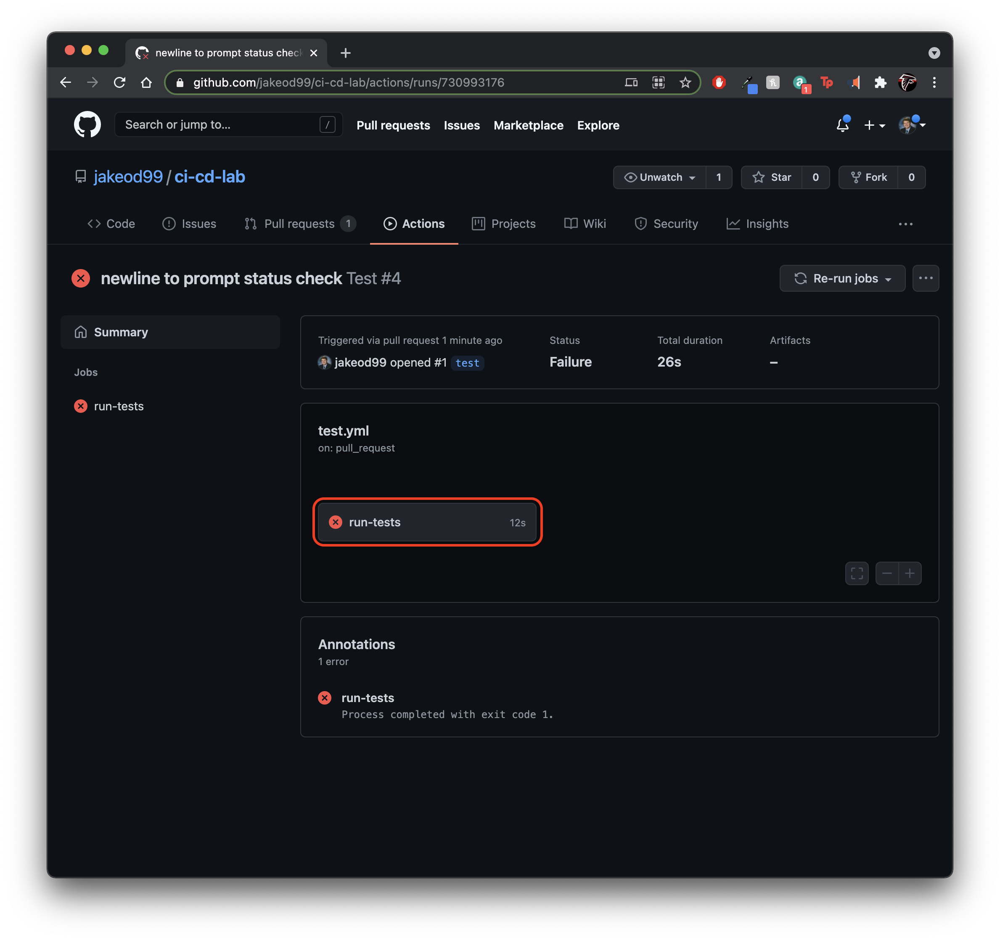

# ci-cd-lab
CI/CD Lab Activity for SWEN-356

This lab focuses in on teaching the basics of Github Actions. You will utilize Github Actions to protect your `master` branch from code that breaks your tests. Basic familiarity with git is necessary. 

To participate, follow the steps below.

## Step 0 - Setup
Fork this repository (click the "Fork" button in the upper right). 



Now, clone the fork:

```
cd ~/[PATH TO WORKSPACE]
git clone https://github.com/[YOUR USERNAME]/ci-cd-lab.git
cd ci-cd-lab
```

Finally, change the module in `go.mod` to reference your fork instead of the original repo. When you've done this, your `go.mod` should look like this: 
```
module github.com/[YOUR USERNAME]/ci-cd-lab

go 1.16
```

Now everything should be configured and ready for you to start the workflow lab!

## Step 1 - Create Workflow
Our goal is to protect the `master` branch from faulty code. We're going to do this by creating a workflow that runs our tests whenever someone opens a Pull Request into `master`. We will then set the success of this workflow as necessary condition for merging the Pull Request into `master`.

To start off, let's ensure you're on the `master` branch and that everything is up-to-date.

```
git checkout master
git pull
```

Now, create a new file in `.github/workflows` named `test.yml`. This is where we'll define everything about our workflow does

First, set the workflow's [name](https://docs.github.com/en/actions/reference/workflow-syntax-for-github-actions#name) by writing the following to start off our `test.yml` file:
```
name: Test
```

Next, we need to define what event(s) will trigger this workflow. To do this, we use the (required) [on](https://docs.github.com/en/actions/reference/workflow-syntax-for-github-actions#on) keyword. [There are many events to choose from](https://docs.github.com/en/actions/reference/events-that-trigger-workflows), but in our case we want our tests to be triggered when a Pull Request aimed at merging into `master` is opened or updated. To achieve this, we can write:
```
on:
  pull_request:
    branches:
      - master
```

Now let's define the [jobs](https://docs.github.com/en/actions/reference/workflow-syntax-for-github-actions#jobs) this workflow needs to perform. In our context, we really only need to define one job, and it's purpose is to run our tests. So let's give it the [job_id](https://docs.github.com/en/actions/reference/workflow-syntax-for-github-actions#jobsjob_id) `run-tests`:
```
jobs:
  run-tests:
```

That job needs an environment to [run on](https://docs.github.com/en/actions/reference/workflow-syntax-for-github-actions#jobsjob_idruns-on). Let's use Ubuntu as our environment for this `run-tests` job.
```
jobs:
  run-tests:
    runs-on: ubuntu-latest
```

Now we just need to define the [steps](https://docs.github.com/en/actions/reference/workflow-syntax-for-github-actions#jobsjob_idsteps) our job will follow in the Ubuntu environment to run our tests. A cool part of Github Actions is that we can build from Github's existing work by using their `actions` library. Our first step should be to clone our work into the Ubuntu environment [using](https://docs.github.com/en/actions/reference/workflow-syntax-for-github-actions#jobsjob_idstepsuses) Github's [checkout](https://github.com/actions/checkout) action:
```
jobs:
  run-tests:
    runs-on: ubuntu-latest
    steps:
      - name: Checkout Code
        uses: actions/checkout@v2
```

The example work in this repo is written in Go, so our second step should be to ensure that we have the proper version of Go installed. Github has an action for this too called [setup-go](https://github.com/actions/setup-go). This action takes a parameter for the version of Go we're using, so we can input that using [with](https://docs.github.com/en/actions/reference/workflow-syntax-for-github-actions#jobsjob_idstepswith):
```
jobs:
  run-tests:
    runs-on: ubuntu-latest
    steps:
      - name: Checkout Code
        uses: actions/checkout@v2

      - name: Install Go
        uses: actions/setup-go@v2
        with:
          go-version: "^1.16"
```

Finally, now that we have our environment set up (operating system, up-to-date code, and tester), we can actually [run](https://docs.github.com/en/actions/reference/workflow-syntax-for-github-actions#jobsjob_idstepsrun) the tests:
```
jobs:
  run-tests:
    runs-on: ubuntu-latest
    steps:
      - name: Checkout Code
        uses: actions/checkout@v2

      - name: Install Go
        uses: actions/setup-go@v2
        with:
          go-version: "^1.16"

      - name: Run Tests
        run: go test -v ./...

```

Great! Now your `test.yml` file should look something like this:
```
name: Test

on:
  pull_request:
    branches:
      - master

jobs:
  run-tests:
    runs-on: ubuntu-latest
    steps:
      - name: Checkout Code
        uses: actions/checkout@v2

      - name: Install Go
        uses: actions/setup-go@v2
        with:
          go-version: "^1.16"

      - name: Run Tests
        run: go test -v ./...

```

Now push your workflow to the remote repository:
```
git checkout master
git pull
git add .
git commit -m "test workflow"
git push
```

## Step 2 - Github Settings
Now that we have our workflow set up and running, let's try it out! We'll make a new branch, create a PR, and watch it fail (the pre-populated tests have a failure, this workflow failing for the right reasons means it's working). Then we will configure our Github repository to rely on a successful workflow run before allowing pull requests to merge into `master`. 

To do this, we need Github to recognize our workflow as a "status check". In order for Github to recognize our workflow as a "status check", we need to perform an event that will trigger the workflow. 

Let's checkout a new branch:
```
git checkout -b test
```

Let's make a small change to an existing file on our new branch. Open `main.go` and add a newline to the end of the file.

Now let's commit that change and push our new branch to the remote repo:
```
git add main.go
git commit -m "newline to prompt status check"
git push --set-upstream origin test
```

Alright, now open a browser and visit your repo's page on Github. Open a Pull Request to merge `test` into `master`.



Opening this PR will prompt your workflow to run. Once the workflow is done running, you'll notice that our PR shows a failed workflow run, but still allows us to merge into `master`. We're close!


Let's make sure this failure blocks merging into `master`. Navigate to `Settings > Branches > Add rule` and do the following:


Inform the prompt that you want this rule to apply to branches with the name `master`, then select `run-tests` as a required successful status check prior to merging.


Now scroll down and hit `create`


If you navigate back to our PR, you'll see that a successful run of `run-tests` is now a requirement for merging!


## Step 3 - Revision
Nice, our workflow reports failing tests, and our repository blocks merging accordingly. Let's fix the failing code, update our PR, and see if it will let us merge in our working code.

Let's see what went wrong with our tests. Navigate to `Actions > new line to prompt status check`:


Click the `run-tests` box to get a more detailed description of what went wrong:


Here we get a description of each step in our `run-tests` job! Looks like each worked as expected, but when we ran the existing `Go` tests we got a failure:


Here is where you take over :)

According to the test description, the `Sum(x, y)` call returned the wrong value. Go into `main.go`, find what you think the problem is, and change what you think needs to be changed. Commit and push your solution to the `test` branch, and see whether your fix caused the test to run successfully. If not, try again. If so, Github will clear you to merge `test` into `master`; once you do that the lab is complete!

## Step 4 - Revel in your newfound knowledge
Yay! Now `master` passes every test and is protected from merging in code that fails tests. Good work!

If you want to dive deeper into some specifics or some new concepts, check out the [Github Actions documentation](https://docs.github.com/en/actions) to round out your workflow education.